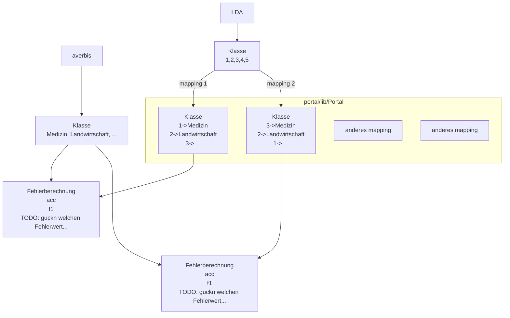

# BA_text_classification

- mapping 1
  -   medizin - 1
  -   umwelt - 2
  -   essen -3 
  -   bauer -4
  -   rest -5
-   mapping 2
   -   medizin - 2
   -   umwelt - 1
   -   essen -3 
   -   bauer -4
   -   rest -5
  
-   mapping 3
  -   medizin - 3
  -   umwelt - 2
  -   essen -1
  -   bauer -4
  -   rest -5

pertubations od comnbinations
keine doppelten
reiehnfolge ist egal
