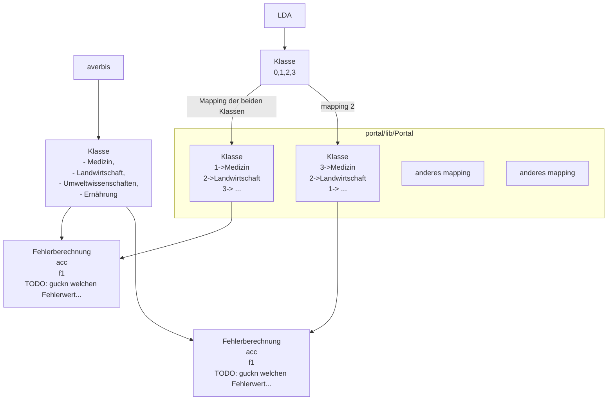

# BA_text_classification

```mermaid

graph TD

subgraph portal/lib/Portal
class2
class2a
class2b[anderes mapping]
class2c[anderes mapping]
end


averbis-->classa[Klasse <br> - Medizin, <br> - Landwirtschaft, <br> - Umweltwissenschaften, <br> - Ernährung]
LDA-->class1[Klasse <br> 0,1,2,3]

class1-->|Mapping der beiden Klassen|class2[Klasse <br> 1->Medizin <br> 2->Landwirtschaft <br>3-> ...]

classa-->error[Fehlerberechnung<br>acc<br>f1<br>TODO: guckn welchen Fehlerwert...]
class2-->error


class1-->|mapping 2|class2a[Klasse <br> 3->Medizin <br> 2->Landwirtschaft <br>1-> ...]

classa---> errora[Fehlerberechnung<br>acc<br>f1<br>TODO: guckn welchen Fehlerwert...]
class2a--->errora


```