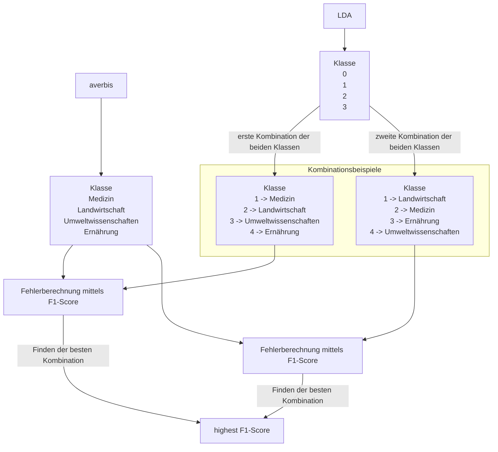

# Textklassifizierung - Topic Modeling
## Bachelorarbeit 2023

Dieses Code Repository enthält den kompletten Code, der im Rahmen der Bachelorarbeit entwickelt wurde. Er besteht aus mehreren Jupyter-Notebooks, die im Unterordner "code" zu finden sind.

Im folgenden erfolgt eine Beschreibug, um die Ergebnisse und Visualisierungen in der Bachelorarbeit zu reproduzieren.

1. Beschreibung Thematik
2. Beschreibung Code

# Beschreibung 
Im Rahmen der Bachelorarbeit wurde ein Datenset von verschiedenen Publikationen der ZB MED für ein Topic Modeling aufbereitet. Die einzelnen Dokumente sollen in ihre T

- Textklassifizierung der Publikationen in ihre Themen
- Optimierungen von Aufbereitungsschritten
- 

# Beschreibung Code

### Vorbereitung

In nachfolgender Tabelle sind eventuelle notwendige Anpassungen im Code beschrieben.

<table>
    <thead>
        <tr>
            <th>Dateiname</th>
            <th>Beschreibung </th>
            <th>Anpassungen</th>
            <th>Variablen</th>
            <th>Input</th>
            <th>Output</th>
        </tr>
    </thead>
    <tbody>
        <tr>
            <td rowspan=2 align="center">01_create-dataset.ipynb</td>
            <td rowspan=2 align="center">Mit diesem Code wird ein kleinerer Korpus für Testzwecke aus der Datenbank erstellt. Hierzu wird ein ausgewogenes Datenset mit einer gleichen Anzahl von allen Klassen definiert und wieder in die Datenbank geschrieben. </td>
            <td align="center"> Mit dieser Variable wird ein Limit der  Datensätze gesetzt</td>
            <td rowspan=1 align="center">lim</td>
             <td rowspan=2 align="center">Rohdaten (ba_corpus_2)</td>
             <td rowspan=2 align="center"> corpus_small</td>
        </tr>
        <tr>
            <td align="center">In den Datensätzen kann zwischen einem Trainingsdatenset und ein Datenset mit den MeSH-Termini von Averbis unterschieden werden. Hierzu wird die Angabe als Typ mitgegeben. </td>
            <td align="center">train, key_eval</td>
        </tr>
        <tr>
            <td rowspan=1 align="center">02_language_detection.ipynb</td>
            <td align="center">Mit diesem Code wird eine Spracherkennung der Dokumente im Korpus durchgeführt.</td>
            <td align="center">-</td>
            <td align="center">-</td>
            <td align="center">corpus_small</td>
            <td align="center">corpus_language</td>
        </tr>
        <tr>
            <td rowspan=1 align="center">03_join_language.sql</td>
            <td align="center">Mit diesem PostqreSQL-Befehl werden die Spalten der Sprachen mit dem Trainigskorpus verbunden.</td>
            <td align="center">-</td>
            <td align="center">-</td>
            <td align="center">corpus_small, corpus_language</td>
            <td align="center">join_language</td>
        </tr>
        <tr>
            <td rowspan=3 align="center">04_get_AGROVOC_data.ipynb</td>
            <td rowspan=2 align="center">Mit diesem Code wird aus dem AGROVOC-Thesaurus ein Dictionary aus Term und entsprechender ID erstellt. </td>
            <td align="center">Hier muss vor Ausführung die nt-Datei unter folgendem Link heruntergeladen werden: https://data.apps.fao.org/catalog/dcat/agrovoc-2023-07 und der Pfad, in dem diese Datei liegt umändern.</td>
            <td align="center">path</td>
            <td rowspan=2 align="center">nt-Datei AGROVOC</td>
            <td rowspan=2 align="center">Pickle-Datei mit Dictionary für die Sprachen Englisch, Deutsch und Französisch, </td>
        </tr>
        <tr>
            <td align="center">Im Weiteren muss das Repository keyword_extraction unter folgendem Link https://github.com/klauslippert/keyword_extraction heruntergeladen werden und dieses im gleichen Ordner wie der Code abgelegt werden. </td>
            <td align="center">-</td>
        </tr>
         <tr>
            <td align="center">Außerdem wird eine Tabelle für die AGROVOC-Mainheadings erstellt. </td>
            <td align="center">-</td>
            <td align="center">-</td>
            <td align="center">Dataframe mit AGROVOC-Daten</td>
            <td align="center">agrovoc_mainheadings</td>
        </tr>
        <tr>
            <td rowspan=3 align="center">05_extract_keywords.ipynb</td>
            <td rowspan=3 align="center">Mit diesem Code wird mithilfe der erstellen Dictionaries die Schlagwörter aus den Dokumenten extrahiert und in eine neue Spalte eingefügt. </td>
            <td align="center">Wen nicht bereits geschehen muss das Repository keyword_extraction unter folgendem Link https://github.com/klauslippert/keyword_extraction heruntergeladen werden und dieses im gleichen Ordner wie der Code abgelegt werden.</td>
            <td align="center"></td>
            <td align="center"></td>
            <td align="center"> </td>
        </tr>
        <tr>
            <td rowspan=2 align="center">Hier muss der Datei-Pfad für die Pickle-Dateien für AGROVOC und Mesh einzeln angepasst werden.</td>
            <td align="center">files_MeSH</td>
            <td rowspan=2 align="center">join_language</td>
            <td rowspan=2 align="center">corpus_keywords_AGROVOC, corpus_keywords_MeSH</td>
        </tr>
            <td align="center">files_agrovoc</
        </tr>
        <tr>
            <td rowspan=1 align="center">06_mesh_mainheadings_title.sql, 07.mesh_mainheadings_abs.sql</td>
            <td rowspan=1 align="center">Mappen der IDs aller Schlagwörter mit den IDs der Mainheadings von MeSH für den Titel und Abstract</td>
            <td align="center">-</td>
            <td align="center">-</td>
            <td align="center">corpus_keywords_MeSH, mesh_mainheadings</td>
            <td align="center">corpus_mesh_title, corpus_mesh_abs</td>
        </tr>
        <tr>
            <td rowspan=1 align="center">08_agro_mainheadings_title.sql, 09_agro_mainheadings_abs.sql</td>
            <td rowspan=1 align="center">Mappen der IDs aller Schlagwörter mit den IDs der Mainheadings von AGROVOC für den Titel und Abstract</td>
            <td align="center">-</td>
            <td align="center">-</td>
            <td align="center">corpus_keywords_AGROVOC, agrovoc_mainheadings</td>
            <td align="center">corpus_agrovoc_title, corpus_agrovoc_abs</td>
        </tr>
        <tr>
            <td rowspan=1 align="center">10_create_corpus_mesh.sql, 11_create_corpus_agrovoc.sql</td>
            <td rowspan=1 align="center">Zusammenfassen der Daten Titel und Abstract zu einem Korpus von MeSH und Agrovoc</td>
            <td align="center">-</td>
            <td align="center">-</td>
            <td align="center">corpus_agrovoc_title, corpus_agrovoc_abs, corpus_mesh_title, corpus_mesh_abs</td>
            <td align="center">corpus_keywords_agro, corpus_keywords_mesh</td>
        </tr>
        <tr>
            <td rowspan=1 align="center">12.1_classification_LDA</td>
            <td rowspan=1 align="center">Durchführung der Klassifizierung mittels LDA</td>
            <td align="center">-</td>
            <td align="center">-</td>
            <td align="center">corpus_keywords_agro, corpus_keywords_mesh, Averbis-Klassen</td>
            <td align="center">Dataframe mit den vorhergesagten Klassen für die Dokumente</td>
        </tr>
  
</table>

