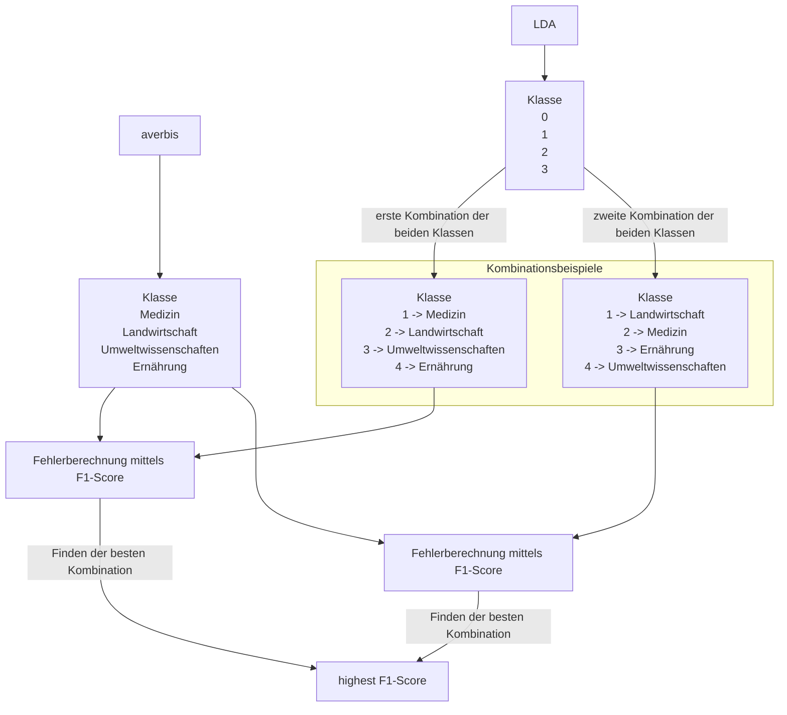

# Textklassifizierung - Topic Modeling
## Bachelorarbeit 2023

Dies ist ein Repository, welches im Rahmen der Bachelorarbeit "Ontologie-basierte Schlagwortextraktion zur Verbesserung des Korpus für die automatische Dokumentklassifizierung des Discovery Services LIVIVO von ZB MED" entwickelt wurde. Es besteht aus mehreren Jupyter-Notebooks auf Basis der Programmiersprache Python, sowie aus PostgreSQL-Befehlen, die im Unterordner "code" zu finden sind. Die Datengrundlage besteht aus einer Datenbank, die mehrere Millionen Publikationen aus LIVIVO enthält und wurde für diese Arbeit zur Verfügung gestellt.

Im Folgenden erfolgt eine Beschreibung der Thematik, sowie der Code-Dateien, um die Ergebnisse und Visualisierungen in der Bachelorarbeit reproduzieren zu können.

1. [Beschreibung Thematik](#beschreibung)
2. [Ordnerstruktur](#ordnerstruktur) 
3. [Datenquellen](#datenquellen)
4. [Durchführung](#durchführung) 
5. [Beschreibung Code](#beschreibung-code)
6. [Darstellung Evaluierung LDA](#darstellung-LDA)

<br>
<br>

# [Beschreibung Thematik](#beschr) 
Das Haupthema der Bachelorarbeit ist es, den Datensatz für eine Textklassifizierung aufzubereiten. Das Ziel besteht darin, die Publikationen in ihre Thematiken einzuordnen.
Die Aufbereitung besteht aus folgenden Schritten:

- Spracherkennung der Publikationen
- Aufbereiten eines Thesaurus im RDF-Format zu einem Nachschlage-Wörterbuch
- Schlagwortextraktion aus Titel und Abstract der Publikationen mittels der Terme im Nachschlage-Wörterbuch

<br>
<br>

# [Ordnerstruktur](#ordner) 

- code <br>
beinhaltet alle Code-Dateien, die mit der run.sh-Datei ausgeführt werden können
- further analysis <br>
beinhaltet Code-Dateien für Analysezwecke und Experimente
    - comparison: Vergleiche mit der Benchmark 
    - experiments: Klassifizierung LDA mit 5 Klassen, Evaluation der Schlagwortextraktion
    - visualization: Visualisierungen zur Analyse der Ergebnisse
<br>
<br>

# [Datenquellen](#quellen) 

- Datei AGROVOC-Thesaurus: https://data.apps.fao.org/catalog/dcat/agrovoc-2023-07 
- Repository keyword extraction: https://github.com/klauslippert/keyword_extraction  

<br>
<br>

# [Durchführung](#run)
Für die Ausführung der Skripte wird die Einrichtung eines [virtual environments](https://docs.python.org/3/library/venv.html) empfohlen. 
Um die requirements.txt innerhalb der virtuellen Umgebung zu installieren, sollte der Paketmanager [pip] (https://pip.pypa.io/en/stable/) verwendet werden.
```bash
pip install requirements.txt
```
Nach Installation der benötigten Bibliotheken kann die run.sh-Datei im Terminal aufgerufen werden, um die Dateien im Unterordner "code" auszuführen.
Vorraussetzung für das erfolgreiche Durchführen des Skripts ist eine leere Datenbank mit den Schemen "ke_stage" & "publ". Im Weiteren muss die Datentabelle "Mesh-Mainheadings" in die Datenbank eingepflegt werden. Diese wurde für die Arbeit zu Verfügung gestellt. 
```bash
sh run.sh
```

<br>
<br>

# [Beschreibung Code](#beschreibung-code)
Die folgende Tabelle beschreibt die Funktionen der einzelnen Dateien und die gegebenenfalls erforderlichen Anpassungen im Code.

<table>
    <thead>
        <tr>
            <th>Dateiname</th>
            <th>Beschreibung </th>
            <th>Anpassungen</th>
            <th>Variablen</th>
            <th>Input</th>
            <th>Output</th>
        </tr>
    </thead>
    <tbody>
        <tr>
            <td rowspan=2 align="center">01_create-dataset.ipynb</td>
            <td rowspan=2 align="center">Mit diesem Code wird ein kleinerer Korpus für Testzwecke aus der Datenbank erstellt. Hierzu wird ein ausgewogenes Datenset mit gleicher Anzahl an Einträgen aller Averbis-Klassen definiert und wieder in die Datenbank geschrieben. </td>
            <td align="center"> Mit dieser Variable wird ein Limit der Datensätze gesetzt</td>
            <td rowspan=1 align="center">lim</td>
             <td rowspan=2 align="center">Rohdaten (ba_corpus_2)</td>
             <td rowspan=2 align="center"> corpus_small_train</td>
        </tr>
        <tr>
            <td align="center">In den Datensätzen kann zwischen einem Trainingsdatenset und ein Datenset, welches die MeSH-Termini von Averbis beinhaltet, unterschieden werden. Hierzu wird die Angabe als Typ mitgegeben. </td>
            <td align="center">train, key_eval</td>
        </tr>
        <tr>
            <td rowspan=1 align="center">02_language_detection.ipynb</td>
            <td align="center">Mit diesem Code wird eine Spracherkennung der Dokumente im Korpus durchgeführt.</td>
            <td align="center">-</td>
            <td align="center">-</td>
            <td align="center">corpus_small_train</td>
            <td align="center">corpus_language</td>
        </tr>
        <tr>
            <td rowspan=1 align="center">03_join_language.sql</td>
            <td align="center">Mit diesem PostqreSQL-Befehl wird die Tabelle der Sprachen-Zuordnung mit dem Trainigskorpus verbunden.</td>
            <td align="center">-</td>
            <td align="center">-</td>
            <td align="center">corpus_small_train, corpus_language</td>
            <td align="center">join_language</td>
        </tr>
        <tr>
            <td rowspan=3 align="center">04_get_AGROVOC_data.ipynb</td>
            <td rowspan=2 align="center">Mit diesem Code wird aus dem AGROVOC-Thesaurus ein Dictionary aus Term und zugehöriger ID erstellt. </td>
            <td align="center">Hier muss vor Ausführung die nt-Datei unter folgendem Link heruntergeladen werden: https://data.apps.fao.org/catalog/dcat/agrovoc-2023-07. Die Pfade, in dem die Datei abliegt, sowie zur Speicherung der Pickle-Dateien müssen angepasst werden.</td>
            <td align="center">path, save_path</td>
            <td rowspan=2 align="center">nt-Datei AGROVOC</td>
            <td rowspan=2 align="center">Pickle-Datei mit Dictionary für die Sprachen Englisch, Deutsch und Französisch </td>
        </tr>
        <tr>
            <td align="center">Im Weiteren muss das Repository keyword_extraction unter folgendem Link https://github.com/klauslippert/keyword_extraction geklont werden und dieses im gleichen Ordner wie der Code abgelegt werden. </td>
            <td align="center">-</td>
        </tr>
         <tr>
            <td align="center">Außerdem wird eine Tabelle für die AGROVOC-Mainheadings erstellt. </td>
            <td align="center">-</td>
            <td align="center">-</td>
            <td align="center">Dataframe mit AGROVOC-Daten</td>
            <td align="center">agrovoc_mainheadings</td>
        </tr>
        <tr>
            <td rowspan=3 align="center">05_extract_keywords.ipynb</td>
            <td rowspan=3 align="center">Mit diesem Code wird mithilfe der erstellen Lookup-Dictionaries die Schlagwörter aus den Dokumenten extrahiert und in eine neue Spalte eingefügt. </td>
            <td align="center">Wenn nicht bereits geschehen muss das Repository keyword_extraction unter folgendem Link https://github.com/klauslippert/keyword_extraction geklont werden und dieses im gleichen Ordner wie der Code abgelegt werden.</td>
            <td align="center"></td>
            <td align="center"></td>
            <td align="center"> </td>
        </tr>
        <tr>
            <td rowspan=2 align="center">Hier muss der Datei-Pfad für die Pickle-Dateien für AGROVOC und Mesh einzeln angepasst werden.</td>
            <td align="center">files_MeSH</td>
            <td rowspan=2 align="center">join_language</td>
            <td rowspan=2 align="center">corpus_keywords_AGROVOC, corpus_keywords_MeSH</td>
        </tr>
            <td align="center">files_agrovoc</
        </tr>
        <tr>
            <td rowspan=1 align="center">06_mesh_mainheadings_title.sql, 07.mesh_mainheadings_abs.sql</td>
            <td rowspan=1 align="center">Mappen der IDs aller Schlagwörter mit den IDs der Mainheadings von MeSH für den Titel und Abstract</td>
            <td align="center">-</td>
            <td align="center">-</td>
            <td align="center">corpus_keywords_MeSH, mesh_mainheadings</td>
            <td align="center">corpus_mesh_title, corpus_mesh_abs</td>
        </tr>
        <tr>
            <td rowspan=1 align="center">08_agro_mainheadings_title.sql, 09_agro_mainheadings_abs.sql</td>
            <td rowspan=1 align="center">Mappen der IDs aller Schlagwörter mit den IDs der Mainheadings von AGROVOC für den Titel und Abstract</td>
            <td align="center">-</td>
            <td align="center">-</td>
            <td align="center">corpus_keywords_AGROVOC, agrovoc_mainheadings</td>
            <td align="center">corpus_agrovoc_title, corpus_agrovoc_abs</td>
        </tr>
        <tr>
            <td rowspan=1 align="center">10_create_corpus_mesh.sql, 11_create_corpus_agrovoc.sql</td>
            <td rowspan=1 align="center">Zusammenfassen der Daten von MeSH und Agrovoc zu einem Korpus</td>
            <td align="center">-</td>
            <td align="center">-</td>
            <td align="center">corpus_agrovoc_title, corpus_agrovoc_abs, corpus_mesh_title, corpus_mesh_abs</td>
            <td align="center">corpus_keywords_agro, corpus_keywords_mesh</td>
        </tr>
        <tr>
            <td rowspan=1 align="center">12.1_classification_LDA</td>
            <td rowspan=1 align="center">Durchführung der Klassifizierung mittels LDA</td>
            <td align="center">Anpassung Pfad für Speicherung des Dataframes als csv</td>
            <td align="center">save_path</td>
            <td align="center">corpus_keywords_agro, corpus_keywords_mesh, Averbis-Klassen</td>
            <td align="center">Dataframe, welches die vorhergesagten Klassen der Dokumente beinhaltet</td>
        </tr>
        <tr>
            <td rowspan=1 align="center">12.2_eval_LDA</td>
            <td rowspan=1 align="center">Evaluierung der LDA mittels F1-Score</td>
            <td align="center">Anpassung Pfad zum Öffnen des Dataframes als csv</td>
            <td align="center">path</td>
            <td align="center">Dataframe der vorhergesagten LDA-Klassen</td>
            <td align="center">Evaluierungswert in Form des F1-Scores</td>
        </tr>
        <tr>
            <td rowspan=1 align="center">13_classification_SGD</td>
            <td rowspan=1 align="center">Durchführung der Klassifizierung mittels SGDC</td>
            <td align="center">Anpassung Pfad für Speichern der F1-Matrix als csv</td>
            <td align="center">path</td>
            <td align="center">corpus_keywords_agro, corpus_keywords_mesh, Averbis-Klassen</td>
            <td align="center">Evaluierungswerte in Form der F1-Matrix</td>
        </tr>
  
</table>


# [Darstellung Evaluierung LDA](#darstellung-LDA)

